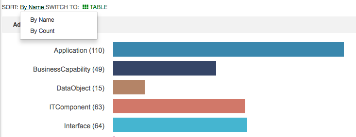
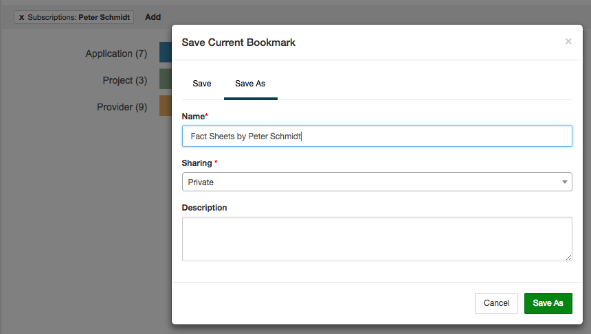

# Features of the LeanIX reporting framework

### Filterable Fact Sheet information
You can configure the framework to fetch certain information of the Fact Sheets contained in a workspace. The user is able to apply filters to the set of Fact Sheets as he/she is used to from the LeanIX inventory.

### Custom Dropdowns
You can configure the framework to display custom dropdowns to the user and inform you if he/she changes the selection.

### Table view
For each report the user can switch to a tabluar view of the data that is currently displayed visually in the report. You can specify the columns of that table view that make sense for your report.

### Save and restore of filters and internal state
The framework provides an infrastructure to save the state of a report. This includes the currently applied fitlers (in case your report uses the filterable Fact Sheet feature) and potential internal state that the user can change within your report. The internal state is represented as a simple JSON. An example for internal state is, that the user can toggle between a barchart and a piechart representation.

